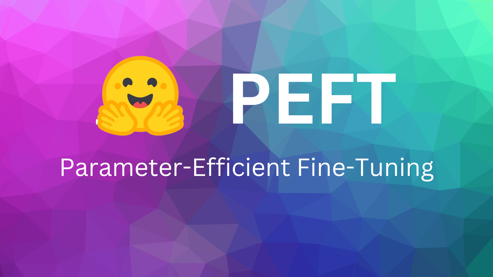

# Fine-Tuning Large Language Models

    

## Fine-Tuning List 📑

|Title|Description|
|:---:|:---:|
|**A. Fine-Tuning T5 with LoRA**|LoRA를 활용하여 T5(LLM) 학습|
|**B. Fine-Tuning Llama2 with QLoRA**|QLoRA를 활용하여 Llama2 학습|
|**C. Supervised-Fine-Tuning gemma**|Gemma, Llama2, mistral0.2v의 학습|
|**D. Fine-Tuning-LLMs-with-QLoRA**|Gemma, Llama2, mistral0.2v의 프롬프트와 QLoRA를 이용한 학습|
